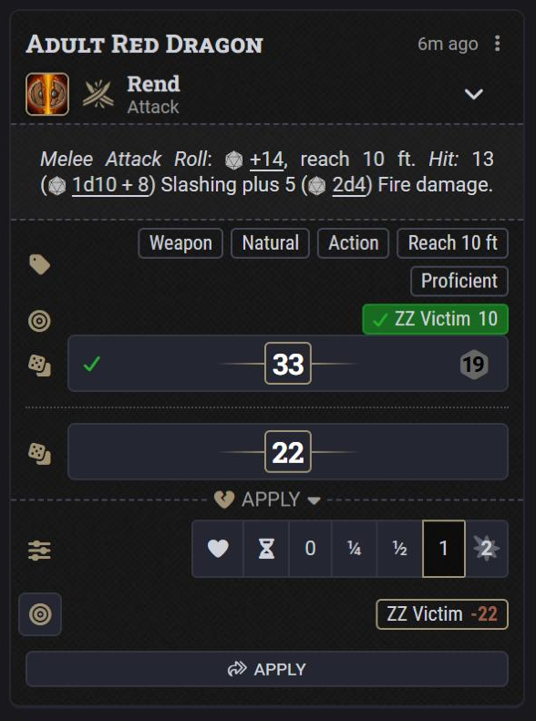
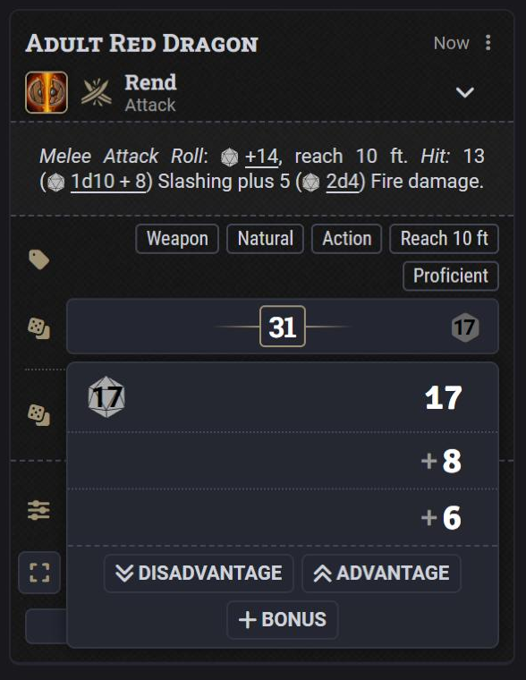
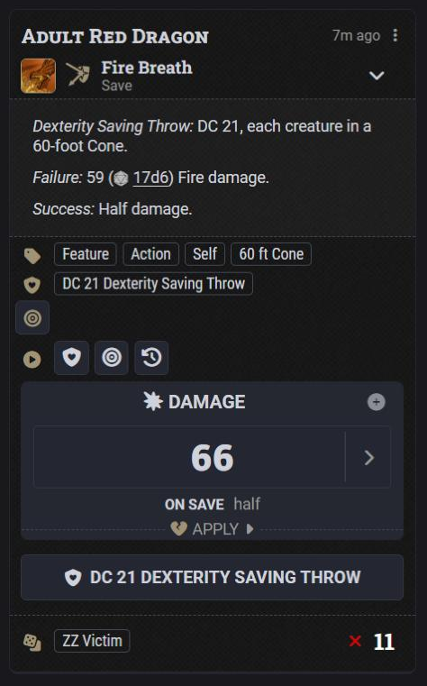
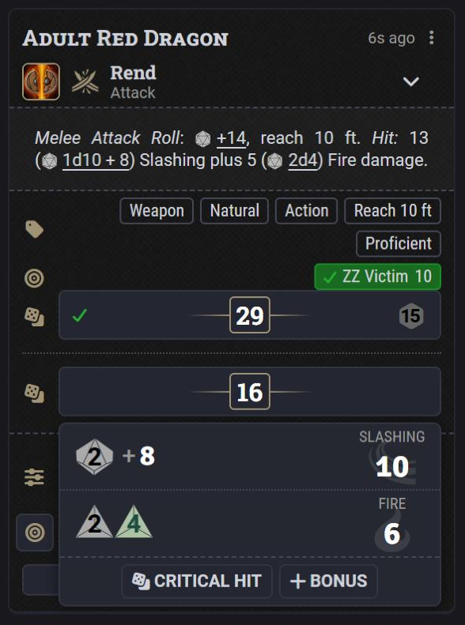
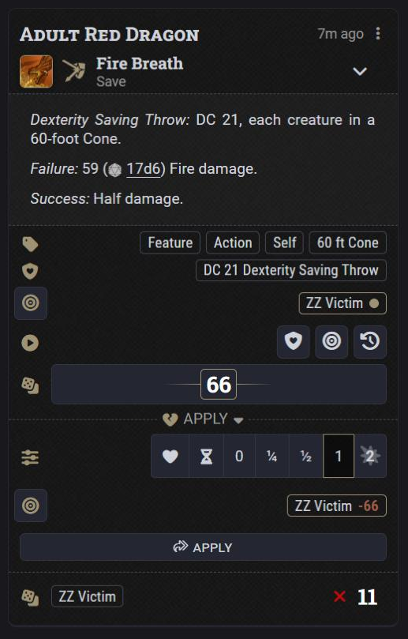

# RSReforged — GMC fork (6.2.0)

> Quality-of-life roll automation for Foundry VTT's D&D 5e system.
> This fork is **[arrowedisgaming/RSReforged](https://github.com/arrowedisgaming/RSReforged) 6.0.0 plus one feature commit** (a *Card Style* setting with a new "Vanilla+" card, and the wide save button back on Classic cards), **plus three optional extras** kept in their own folder.

Requires Foundry VTT 14 and dnd5e 6.x. Like upstream 6.0.0, dnd5e 6 support is experimental.

**Install by manifest URL**

```
https://raw.githubusercontent.com/maxobremer/RSReforged/master/module.json
```

The package id is `rsreforged`, the same as upstream, so install one or the other.

| Vanilla+ card | Roll breakdown | Classic card with the wide save button |
|---|---|---|
|  |  |  |

---

## For the upstream author

Everything below is offered for you to take, in part or in full, or to ignore. It is one commit on top of your `release-6.0.0`:

- **Patch:** [`docs/patches/card-style-vanilla-plus.patch`](docs/patches/card-style-vanilla-plus.patch), a `git format-patch` file. On a checkout of `release-6.0.0`: `git am card-style-vanilla-plus.patch`, then `npm test`.
- **Size:** 10 files, +844 / −51. 322 of those lines are tests. Your suite plus the new tests: 440 passing.
- **Not included in that patch:** anything under `src/gmc/`, this README, and this fork's `module.json` and workflows. Those are fork-only (see [GMC extras](#gmc-extras-fork-only)).
- **About this repository's history:** `master` here is this fork's older dnd5e 6 port with the 6.2.0 tree committed on top, so a diff against your `master` is noisy. The patch file is the clean view. Everything in `src/utils/`, `src/module/`, `templates/`, `lang/`, `tests/` and `css/rsreforged.css` at 6.2.0 is byte-for-byte your 6.0.0 with that patch applied.

### 1. Card Style setting

**What:** a world setting, `cardStyle`, registered first in `settings.js`. Choices: `classic` (default) and `vanilla`. `SettingsUtility.useVanillaCards` reads it. It only affects dnd5e 6 cards.

**Why:** some tables prefer dnd5e 6's own compact roll rows to the 4.x sections, but still want what RSReforged adds: one card per use, quick rolls, and the after-the-roll edits. A setting lets both looks live in one module without a second workflow. The default is `classic`, so nothing changes for existing users.

### 2. Vanilla+ card (`src/utils/native-vanilla.js`, new, 206 lines)

| Attack | Damage breakdown | Save |
|---|---|---|
|  |  |  |

**What it does**

- For each native attack / damage / healing / formula child of a usage card it calls `child.renderHTML()` and **moves** every element except the `.chat-card` header into a wrapper that carries the child's `data-message-id` and `data-rsr-message-id`, exactly as your classic sections do. That wrapper goes where your sections go, in `.rsr-native-combined`. The fold-in, ordering, hiding of the originals, hiding of represented buttons, and the Dice So Nice reveal are all your existing code in `native-render.js`; only the section renderer is swapped.
- Inside each `.roll-breakdown` it appends a row of buttons: **Disadvantage / Advantage** (normal d20 only), **Critical Hit** (damage that is not yet critical), **Bonus**. They call the same functions as your overlays (see 3).
- The same buttons are added to standalone check and save cards that RSReforged rolled, and to the save / check lines dnd5e summarises on a usage card.
- **Hide NPC Roll Results** is applied to the row (total or d20 + breakdown, by *Hidden Roll Style*), and the **Always Roll Multiple Dice** spare d20 is shown as a faded die beside the real one.
- **Click-to-reroll and GM fudge** work: the dice in dnd5e's breakdown are stamped with `data-rsr-roll / -die / -result` so `reroll.js` acts on them unchanged.

**Why it is built this way**

- **RSReforged draws no roll in this style.** The markup is whatever dnd5e renders, so a dnd5e template change does not need a matching change here, and anything another module does to a native attack or damage message in `dnd5e.renderChatMessage` is already on the row when it is moved.
- **No template paths and no private dnd5e APIs.** It depends on: `ChatMessage#renderHTML`; a `button.dice-roll` followed by its `.roll-breakdown`; `.chat-card` as the header to leave behind.
- **Dice are stamped only when they can be verified.** dnd5e may list damage per roll or merged per type, so both layouts are computed (through `damageDieSources`, see 3) and each die's shown value is compared with the roll's. Any difference in count or value leaves that breakdown unstamped and therefore inert, rather than risk rerolling the wrong die.

**Not in Vanilla+ (still Classic-only):** click-to-cycle damage types, and the RSReforged quick apply buttons (Vanilla+ always shows dnd5e's tray). After an edit the card redraws and the breakdown popover closes; Classic re-opens its breakdown, Vanilla+ does not yet.

### 3. Small refactor in `native-card.js`

**What:** the bodies of the two overlay click handlers are now exported functions, and the overlays call them:

- `retroAdvantage(child, state, { flavor, event })`
- `retroCritical(child, event)`
- `canEditRolls(child)` (was `_canEdit`), `onEditClick(buttons, handler)` (wraps `_onOverlayClick`)
- `damageDieSources(rolls, sources, aggregate)`: the die-to-roll mapping `_renderDamage` already built (display copies tagged with `options.rsrSource`, passed through `dnd5e.dice.aggregateDamageRolls`, read back with `_simplifyDamageRoll`), returned as data. `_renderDamage` now uses the same helper (`_damageParts`).

**Why:** so both card styles run one implementation of each edit, including your confirmation settings, the "roll changed meanwhile" guard and the dice throw. No behaviour change is intended for Classic; your existing `native-card` tests pass unmodified.

### 4. Wide saving throw button on Classic cards


**What:** `addWideSaveButtons(message, content)` in `native-render.js`. For every `button[data-action="rollSave"]` on the usage card it adds one full-width button under the roll sections (or under the item card when nothing was rolled) and above the save results. The label is dnd5e's own (`DND5E.SavingThrowDC`, or `DND5E.SavePromptTitle` when `message.shouldDisplayChallenge` is false).

**Why:** dnd5e 6 shows the save as a small shield among the card's action icons, which is easy to miss at the table; 4.x users know the wide button.

**How it stays safe:** the wide button has no `data-action`. Its click is forwarded, with Shift / Ctrl / Alt / Meta, to dnd5e's own button, so the roll, targets, dialog rules and permissions are dnd5e's. dnd5e's icon stays where it is.

### 5. Supporting changes

| File | Change |
|---|---|
| `src/utils/settings.js` | `CARD_STYLES`, `SETTING_NAMES.CARD_STYLE`, registration, `useVanillaCards` |
| `src/utils/native-render.js` | pick the section renderer by style; `rsr-vanilla-card` / `rsr-vanilla` classes; decorate summaries (Vanilla+) or add the wide save button (Classic); Vanilla+ branch in `renderNativeCheck` |
| `css/rsreforged.css` | new rules for the wide button, the breakdown buttons, the faded spare d20 and the section divider. Two existing selectors gained `:not(.rsr-vanilla-card)` so the left-aligned description and pills stay a Classic-only adjustment |
| `lang/en.json` | `settings.cardStyle.*`, `choices.cardStyle.*`, `chat.buttons.bonus`, `chat.buttons.bonusShort`, `chat.ignoredDie` |
| `tests/native-vanilla.test.mjs`, `tests/native-card-style.test.mjs`, `tests/native-card.test.mjs` | 23 new tests |
| `CHANGELOG.md` | entry under *Unreleased* |

### What was checked

- `npm test`: 440 passing.
- Live on Foundry 14.368 / dnd5e 6.0.5, as GM: quick attack and save-with-damage cards in both styles; retroactive advantage on attacks, standalone checks and summarised saves; critical promotion; bonus on a check and on damage; click-to-reroll on damage and on a summarised save; GM fudge; the wide save button rolling for a target and surviving the card redraw; dnd5e's tray applying full, half and temp HP from a Vanilla+ card.
- **Not checked:** a player's view of Hide NPC Roll Results in Vanilla+ (unit-tested only), Dice So Nice, healing and utility-formula activities, non-English clients, a detached chat window.

### Taking only part of it

- **Only the wide save button:** `addWideSaveButtons` and its one call in `renderNativeMessage`, the `.rsr-wide-*` CSS, and the tests in `native-card-style.test.mjs` that mention it. It does not need the setting; drop the `vanilla` condition around the call.
- **Only Vanilla+:** everything except `addWideSaveButtons` and its CSS.
- **Only the refactor:** the `native-card.js` hunk stands alone.

---

## GMC extras (fork only)

Three additions that are not part of the commit above. They live in `src/gmc/`, are loaded as a separate `esmodules` entry, import nothing from `src/utils/`, and each is wrapped so a failure cannot stop RSReforged.

| Extra | What it does | File |
|---|---|---|
| Damage tray facelift | On dnd5e's `<damage-application>` tray: a heart for "apply as healing", a ×2 burst, tooltips, and an hourglass **temp HP mode** that previews and applies the total as temporary hit points | `src/gmc/tray.js` |
| Hide Private Rolls Completely | GM, blind and self rolls are hidden entirely from players who may not see them (no "???" card, no summary line). The GM gets an eye on the summary line to reveal the roll, and to make it private again | `src/gmc/privacy.js` |
| Fast-Forward Rolls | Rolls with no dialog choice of their own (card buttons, save requests, hit dice) skip the configuration dialog unless Shift is held | `src/gmc/extras.js` |

`tray.js` wraps prototype methods of dnd5e's tray element, which is the kind of dependency upstream avoids; that is the main reason these are kept apart.

Their strings are merged in on `i18nInit` from `src/gmc/strings.js`, and their styles are `css/gmc-extras.css`, so upstream's `lang/` and `css/rsreforged.css` stay upstream's files.

## Settings added by this fork

- **Card Style** (world): Classic RSReforged, or Vanilla+ (dnd5e compact rows).
- **Fast-Forward Rolls (Shift to Configure)** (client) and **Hide Private Rolls Completely** (world), from the GMC extras.

All of upstream's settings are unchanged. In particular, a Shift-click still means "use dnd5e's normal dialogs and messages": the roll is not quick-rolled and is not folded onto the card, in either style.

## Updating this fork to a new upstream release

1. Check out the new upstream tag and `git am docs/patches/card-style-vanilla-plus.patch`. Conflicts, if any, will be in `native-card.js` and `native-render.js`.
2. `npm ci && npm test`.
3. Keep `src/gmc/`, `css/gmc-extras.css`, and the third `esmodules` and second `styles` entries in `module.json`.

## Credits and license

RSReforged is maintained by [arrowedisgaming](https://github.com/arrowedisgaming); it is a fork of Ready Set Roll for D&D5e by MangoFVTT, itself a rewrite of Better Rolls for 5e by RedReign. See upstream's [README](https://github.com/arrowedisgaming/RSReforged#readme) for the full feature list, and [`CHANGELOG.md`](CHANGELOG.md) for history. Licensed under GPL-3.0, see [`LICENSE`](LICENSE).
